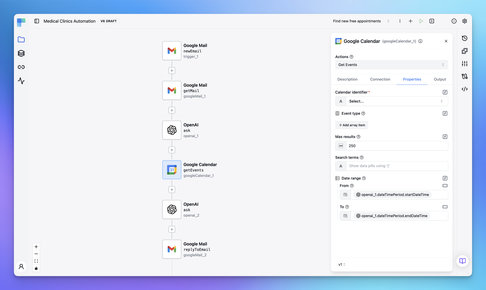

<p align="center">
    <a href="https://www.devagentic.io?utm_source=github&utm_medium=organic&utm_campaign=readme">
        
    </a>
</p>

<h1 align="center" style="border-bottom: none">API integration and workflow automation platform</h1>

<p align="center">
    <a href="https://www.devagentic.io?utm_source=github&utm_medium=organic&utm_campaign=readme">Website</a> - <a href="https://docs.devagentic.io?utm_source=github&utm_medium=organic&utm_campaign=readme">Documentation</a> - <a href="https://discord.gg/VKvNxHjpYx">Discord</a> - <a href="https://twitter.com/devagentichq">Twitter</a>
</p>

<p align="center">
    <a href="https://github.com/devagentichq/devagentic/actions/workflows/build_push.yml"></a> <a href="https://github.com/devagentichq/devagentic/blob/master/LICENSE"></a>
</p>

> UPDATE: DevAgentic is under active development. We are in the alpha stage, and some features might be missing or disabled.



## What is DevAgentic?

DevAgentic is an open-source, low-code, extendable API integration and workflow automation platform. DevAgentic can help you as:

- An automation solution that allows you to integrate and build automation workflows across your SaaS apps, internal APIs, and databases.
- An embedded solution targeted explicitly for SaaS products, allowing your customers to integrate applications they use with your product.

### Key Features

- Intuitive UI Workflow Editor: build and visualize workflows via the UI editor by dragging and dropping components and defining their relations.
- Event-Driven & Scheduled Workflows: automate scheduled and real-time event-driven workflows via a simple trigger definition.
- Multiple flow controls: use the range of various flow controls such as condition, switch, loop, each, parallel, etc.
- Built-In Code Editor: if you need to go beyond no-code workflow definition, leverage our low-code capabilities and write workflow definitions in JSON format and blocks of the code executed during the workflow execution in one of the languages: Java, JavaScript, Python, and Ruby with syntax highlighting, auto-completion and real-time syntax validation.
- Rich Component Ecosystem: hundreds of components built in to extract data from any database, SaaS applications, internal APIs, or cloud storage.
- Extendable: develop custom connectors when no built-in connectors exist in the above-mentioned languages.
- AI ready: built-in AI components that can run multiple AI models and other AI algorithms.
- Developer ready: expose your workflows as APIs to be consumed by other applications or call directly APIs of targeted services. The platform handles authentication.
- Version Control Friendly: write your workflows from the UI editor and push them to your preferred Git branch directly from DevAgentic, enabling best practices with CI/CD pipelines and version control systems.
- Self-hosted: install DevAgentic on the premise to have complete control over execution and data, in addition to being able to use a hosted version.
- Scalable: it is designed to handle millions of workflows with high availability and fault tolerance. Start with one instance only, and scale as required.
- Structure & Resilience: bring resilience to your workflows with labels, sub-flows, retries, timeout, error handling, inputs, outputs that generate artifacts in the UI, variables, conditional branching, advanced scheduling, event triggers, dynamic tasks, sequential and parallel tasks, and skip tasks or triggers when needed by disabling them.

## Getting Started
There are couple ways to give DevAgentic a quick spin on your local machine. You can use this to test, learn or contribute.

### Docker

#### Method 1 - Start Containers With Docker Compose

**Requirement:** [Docker Desktop](https://www.docker.com/products/docker-desktop/)

This is the fastest possible way to start DevAgentic. There is [docker-compose.yml](https://github.com/devagentichq/devagentic/blob/master/docker-compose.yml) in the repository root. Either checkout repository locally to your machine or download file. Make sure you execute this command taking care of correct path to `docker-compose.yml` file:
```bash
docker compose -f docker-compose.yml up
